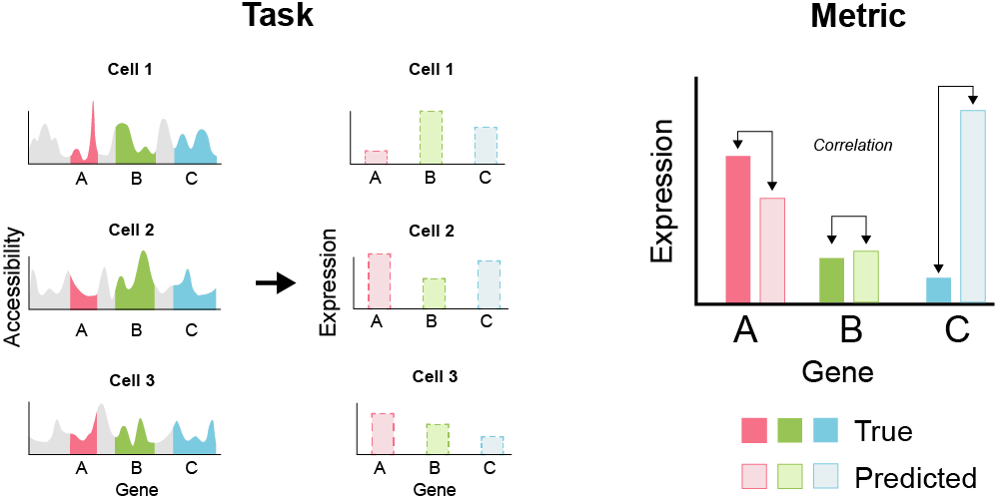

# Multimodal-Single-Cell-Integration

This repositories is for kaggle competition Multimodal Single Cell Integration

https://www.kaggle.com/competitions/open-problems-multimodal

* [Data overview](./metadata/)
* [Multiome data Analyze](./multi/)
* [CITEseq data Analyze](./cite/)
* [Evaluation data Analyze](./submission/)

## Context
In the past decade, the advent of single-cell genomics has enabled the measurement of DNA, RNA, and proteins in single cells. These technologies allow the study of biology at an unprecedented scale and resolution. Among the outcomes have been detailed maps of early human embryonic development, the discovery of new disease-associated cell types, and cell-targeted therapeutic interventions. Moreover, with recent advances in experimental techniques it is now possible to measure multiple genomic modalities in the same cell.

While multimodal single-cell data is increasingly available, data analysis methods are still scarce. Due to the small volume of a single cell, measurements are sparse and noisy. Differences in molecular sampling depths between cells (sequencing depth) and technical effects from handling cells in batches (batch effects) can often overwhelm biological differences. When analyzing multimodal data, one must account for different feature spaces, as well as shared and unique variation between modalities and between batches. Furthermore, current pipelines for single-cell data analysis treat cells as static snapshots, even when there is an underlying dynamical biological process. Accounting for temporal dynamics alongside state changes over time is an open challenge in single-cell data science.

Generally, genetic information flows from DNA to RNA to proteins. DNA must be accessible (ATAC data) to produce RNA (GEX data), and RNA in turn is used as a template to produce protein (ADT data). These processes are regulated by feedback: for example, a protein may bind DNA to prevent the production of more RNA. This genetic regulation is the foundation for dynamic cellular processes that allow organisms to develop and adapt to changing environments. In single-cell data science, dynamic processes have been modeled by so-called pseudotime algorithms that capture the progression of the biological process. Yet, generalizing these algorithms to account for both pseudotime and real time is still an open problem.

Competition host Open Problems in Single-Cell Analysis is an open-source, community-driven effort to standardize benchmarking of single-cell methods. The core efforts of Open Problems include the formalization of existing challenges into measurable tasks, a collection of high-quality datasets, centralized benchmarking of community-contributed methods, and community-focused events that bring together diverse method developers to improve single-cell algorithms. They're excited to be partnering with Cellarity, Chan Zuckerbeg Biohub, the Chan Zuckerberg Initiative, Helmholtz Munich, and Yale to see what progress can be made in predicting changes in genetic dynamics over time through interdisciplinary collaboration.

There are approximately 37 trillion cells in the human body, all with different behaviors and functions. Understanding how a single genome gives rise to a diversity of cellular states is the key to gaining mechanistic insight into how tissues function or malfunction in health and disease. You can help solve this fundamental challenge for single-cell biology. Being able to solve the prediction problems over time may yield new insights into how gene regulation influences differentiation as blood and immune cells mature.

## Goal of the Competition
The goal of this competition is to predict how DNA, RNA, and protein measurements co-vary in single cells as bone marrow stem cells develop into more mature blood cells. You will develop a model trained on a subset of 300,000-cell time course dataset of CD34+ hematopoietic stem and progenitor cells (HSPC) from four human donors at five time points generated for this competition by Cellarity, a cell-centric drug creation company.

In the test set, taken from an unseen later time point in the dataset, competitors will be provided with one modality and be tasked with predicting a paired modality measured in the same cell. The added challenge of this competition is that the test data will be from a later time point than any time point in the training data.

Your work will help accelerate innovation in methods of mapping genetic information across layers of cellular state. If we can predict one modality from another, we may expand our understanding of the rules governing these complex regulatory processes.

      

