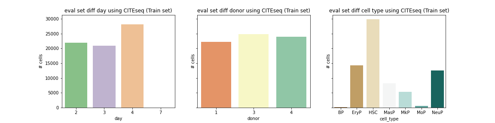
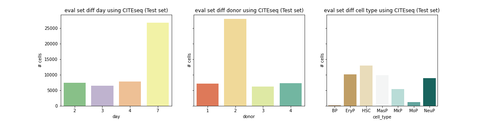
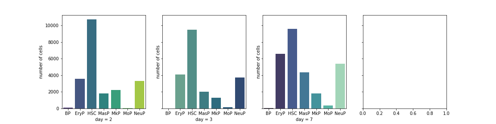
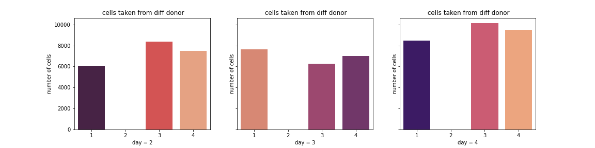
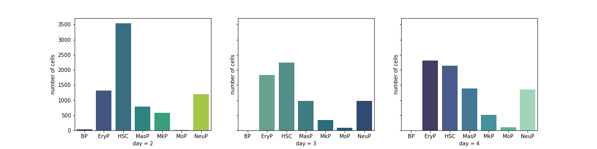
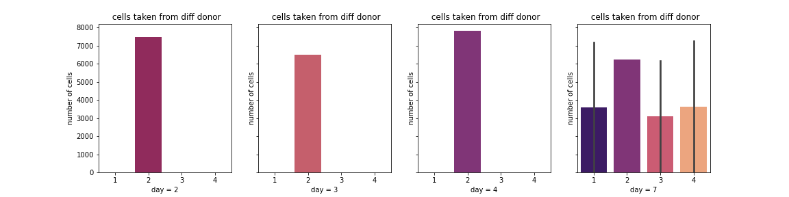
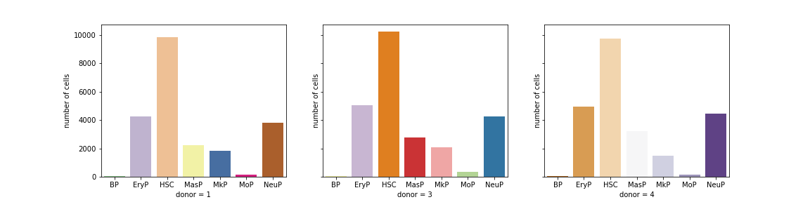
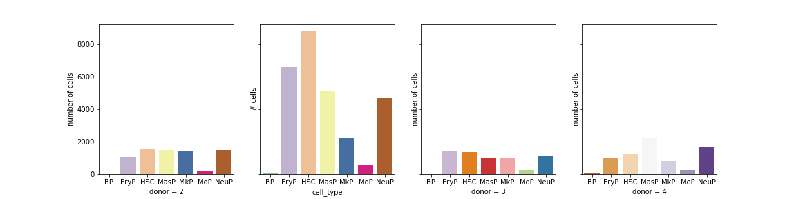

# Citeseq

# Data Overview

## Training Set

          

## Test Set

          

# Analyze by day

## Training Set

          

          

## Test set

          

          

# Analyze by donor
## Training Set

          

## Test set

          

