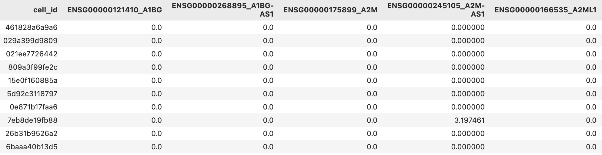
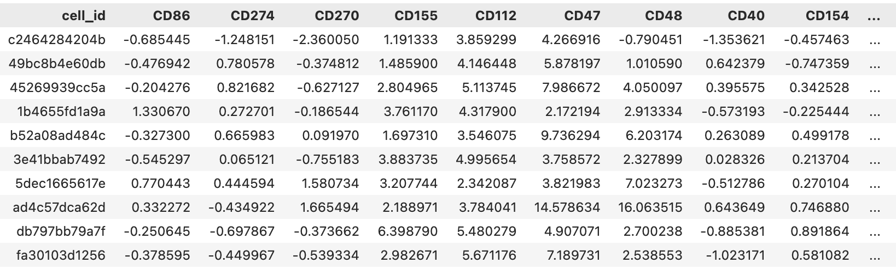
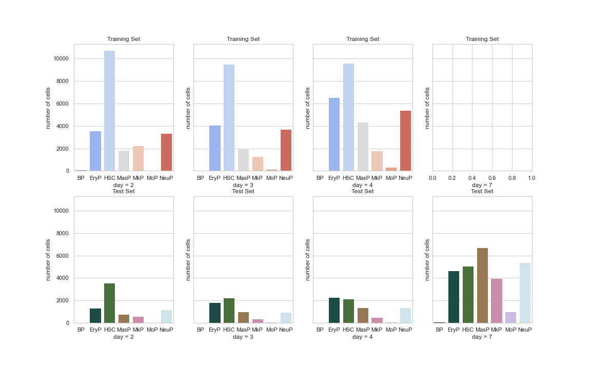
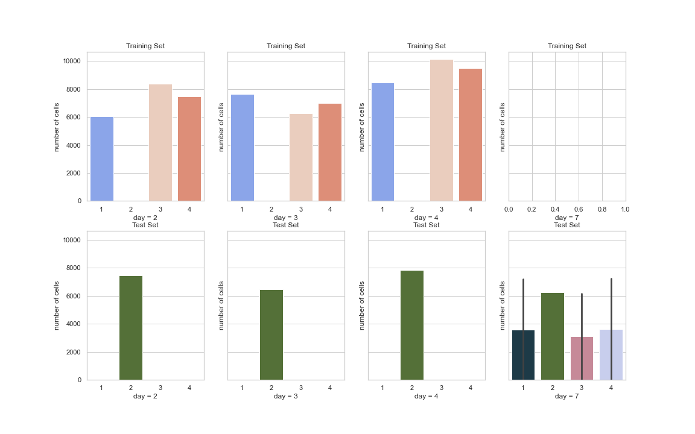

# Citeseq
- [Citeseq](#citeseq)
- [Task Describe](#task-describe)
- [Data Visualization](#data-visualization)
  - [Overview](#overview)
  - [Day v.s. Cell Type](#day-vs-cell-type)
  - [Day v.s. Donor](#day-vs-donor)
  - [Donor v.s. Cell Type](#donor-vs-cell-type)
- [How We made Prediction](#how-we-made-prediction)
  - [Baseline model](#baseline-model)

# Task Describe
For each cell, we are given cell id and the accessibility of its gene, we need to predict the expression of this genne.

* Training Data

          

* Target Data

          

# Data Visualization
## Overview
* Data Distribution of Training Set and Testing Set

          

* There are 70919 cell samples used for Training set
* There are 48616 cell samples used for Test set

## Day v.s. Cell Type

          

## Day v.s. Donor

          

## Donor v.s. Cell Type

          

# How We made Prediction

## Baseline model

| Layer Name | Layer Details| Out size |
| :-----:| :----: | :----: |
| FC1 | nn.Linear(22050, 10000) | (10000,) |
| FC2 | nn.Linear(10000 * 4096 | (4096,) |
| FC3 | nn.Linear(4096 * 1000) | (1000,) |
| FC4 | nn.Linear(1000 * 140) | (140,) |

* A 4-layer fully connected network 
* Split the training dataset into 60 mini-batch and train for 60 epoches.
* Only consider the accessibility of each cell's gene, did not consider the cell type, day and donor variables
* Using Adam as optimizer with Learning rate = 0.001
* Using L1 loss as the loss function
