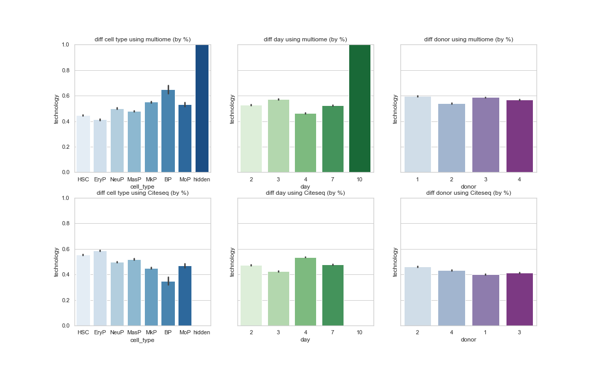

# Data Overview:

从四个人身上采集8种不同的细胞，在第2，3，4，7，10天采集，并应用两种不同的技术来分析

* 四人的编号: 13176, 27678, 31800, 32606
* 八种细胞分别为
    * HSC: 造血干细胞
    * EryP: 巨核細胞（红细胞的祖细胞）
    * BP: B淋巴球（白血球中一種淋巴細胞的亞型）
    * NeuP: 造血干/祖细胞
    * MkP: 巨核-红系祖细胞（分化为巨核祖细胞与红系祖细胞）
    * MasP: 肥大细胞（机体侵入门户的哨兵）
    * MoP: 单核细胞前体
    * Hidden: 不给看
* 两种技术
    * CITEseq: measures gene expression (RNA) and surface protein levels.
    * Multiome: measures gene expression (RNA) and chromatin accessibility
    

          
    

* 数据采集
    * 训练数据（Training Set）
        * 训练数据只包含从13176， 31800和32606号实验体上采集的数据
        * 对于使用Multiome技术的数据，只从第2，3，4，7天采集
        * 对于使用CITEseq技术的数据，只从第2，3，4天采集
    * 可见测试数据（public test set）
        * 只包含从276786号实验体上采集的数据
        * 对于使用Multiome技术的数据，只从第2，3，7天采集
        * 对于使用CITEseq技术的数据，只从第2，3，4天采集
    * 不可见测试数据（private test set）
        * 包含从13176， 276786，31800和32606号实验体上采集的数据
        * 对于使用Multiome技术的数据，只从第10天采集
        * 对于使用CITEseq技术的数据，只从第7天采集
    * Note: There are no day 10 CITEseq samples in any split.
        
* 任务

    * Your task is to predict the labels corresponding to the inputs in the test set. To facilitate submission scoring, we only require predictions on a subset of the Multiome data. This subset was created by sampling 30% of the Multiome rows, and for each row, 15% of the columns. The sample of columns varies from row-to-row. All of the CITEseq labels are scored.

# Data Prepareation:
数据的预处理阶段, 我们将原本数据的 **donor** 和 **technology** 进行了如下改变:

* donor :
    * 13176 -> 1
    * 27678 -> 2
    * 31800 -> 3
    * 32606 -> 4

* technology:
    * citeseq -> 0
    * multiome -> 1

# Overview of smaples taken from multiome and CITEseq
基于图表，可以得出：

      

* 细胞种类
    * Hidden 细胞全部使用multiome
    * 除去hidden， BP细胞（B淋巴球）使用multiome的比例最大，约为65%
    * EryP（巨核細胞）使用使用multiome的比例最小，约为43%
* 天数
    * 第十天全部使用multiome
    * 其他天数使用multiome与CITEseq的比例基本相同
* 实验体
    * 不同实验体使用multiome与CITEseq的比例基本相同
    
* 推测
    * 基于“细胞种类”第一条与“天数”第一条，有可能第十天全为Hidden cell
    * 第三天multiome使用的BP细胞较多，CITEseq使用的BP细胞较少
    * 第四天multiome使用的Eryp细胞较少，CITEseq使用的Eryp细胞较多

# Cell taken from diff donor in diff day
* Numerical plot

      

* Percentage plot

      

# Cell taken from diff cell type in diff day

      

# Cell taken from diff cell type in diff donor

      

# Details
## Number of cells taken from each **donor** in each **day** 
* CITEseq

      

* Multiome

      

## Number of cells taken from each **cell type** in each **day** 

* CITEseq

      

* Multiome

      

## Number of cells taken from each **cell type** by each **donor** 
* CITEseq

      

* Multiome

      

