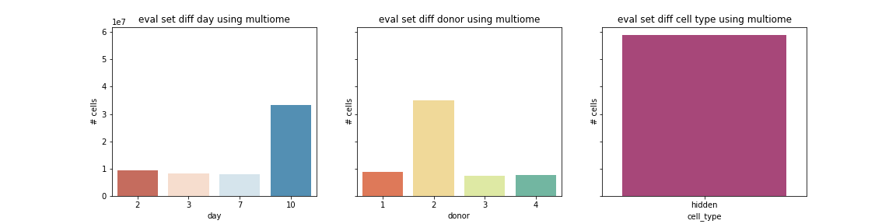
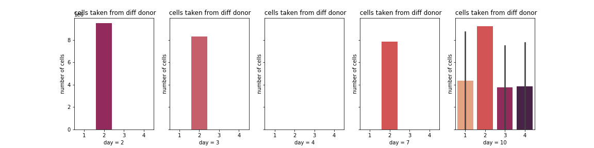
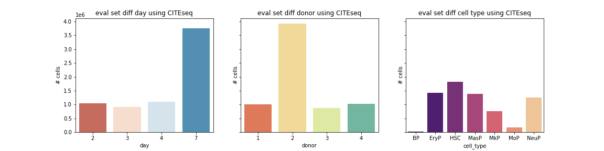
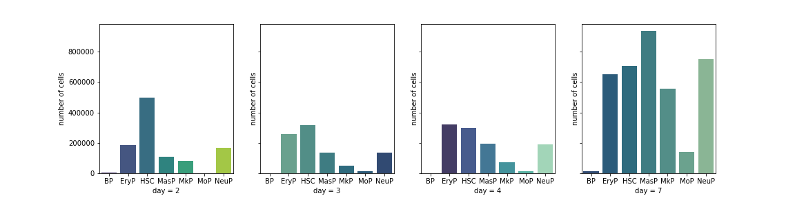
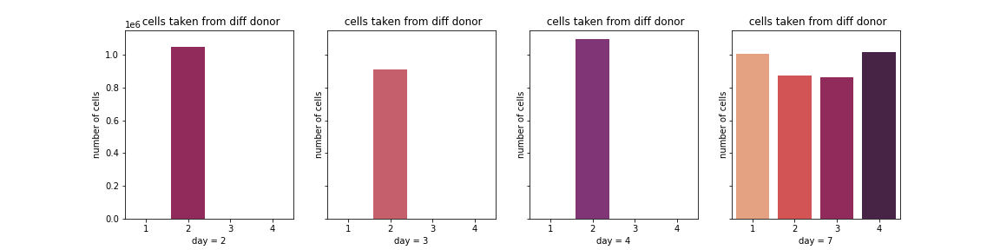
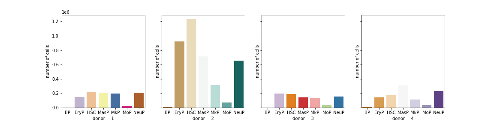

# Evaluation Data Describe

* [Citeseq](##citeseq)
* [Multiome](##multiome)
* donor :
    * 13176 -> 1
    * 27678 -> 2
    * 31800 -> 3
    * 32606 -> 4
## Multiome

### Data Describle
* All cell type are hidden
* Most cells are taken from day 10
* Most cells are taken from donor 2
* In day 2, 3 and 7, cells are only taken from donor 2
* In day 10, cells are taken from all four donors
* No cell was taken from day 4

          

### Analyze by day and donor

        

## Citeseq

### Data Describle
* There was no cell with cell_type = hidden measured by Citeseq
* Most cells are taken from day 7
* Most cells are taken from donor 2
* The number of different types of cells varies greatly
* In day 2, 3 and 4, cells are only taken from donor 2

          

### Analyze by day

        

        

### Analyze by donor

        

